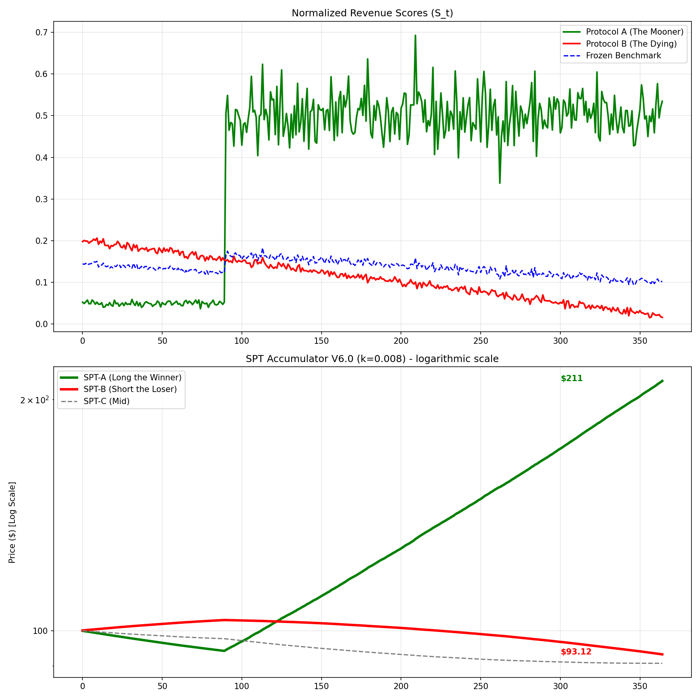

# SPT Accumulator Grid (v7.0 – Rebasing Edition)

**The only DeFi primitive that directly prices a protocol's revenue dominance — with native yield, no cap, no reset, and no mercy.**

---

## 1. Abstract

The SPT Market is a **continuous prediction market** for protocol fundamentals. It allows users to make a real-time tradable bet on whether a protocol (e.g., Aave) will generate more or less revenue than its fair share ($S_{benchmark}$) this quarter.

Unlike binary options (Polymarket) which have low liquidity and single-point resolution, SPT Markets offer:
1.  **Continuous Liquidity:** Trade in/out at any time via a focused AMM.
2.  **Streaming Resolution:** Price updates daily based on actual on-chain performance.
3.  **Native Yield:** Balance rebases daily to distribute vault earnings.

Technically implemented as a **Rebasing Accumulator Token**, this architecture delivers the "Polymarket experience" with the liquidity depth of a Perpetual Swap and the yield of stETH.

---

## 2. The Hero Difference

| Feature                     | Polymarket         | Perps (Price)        | SPT Accumulator (Revenue) |
|-----------------------------|--------------------|----------------------|---------------------------|
| **Underlying**              | Binary event       | Token price          | Real revenue market share |
| **Lifespan**                | Dies at resolution | Perpetual            | Perpetual                 |
| **Volatility**              | Fixed (0 or 100)   | Market-driven        | Unbounded exponential     |
| **Manipulation Resistance** | Low (thin books)   | Medium (oracle games)| High (frozen benchmark)   |
| **Liquidity**               | Event-bound        | Fragmented           | Shared vault (Day 1 deep) |
| **Yield**                   | None               | None                 | **Native Rebase (5-15%)** |

This is not a prediction market. It is a **revenue dominance accumulator** with real-money consequences on both sides.

---

## 3. Formal Primitive Decomposition

The SPT Accumulator can be decomposed into five atomic financial primitives:

| # | Primitive | Definition |
|---|-----------|------------|
| **1** | Perpetual | No expiry. Exposure never resets. |
| **2** | Path-Dependent | Final value depends on the entire trajectory of revenue dominance, not a single snapshot. Every daily deviation compounds forward. |
| **3** | Revenue-Share Accumulator | Underlying variable is not price. It is protocol $i$'s share of total DeFi revenue relative to a frozen benchmark. You are accumulating the divergence day after day. |
| **4** | Synthetic TRS | Economically identical to a total-return swap where you receive the "total return" of the revenue-share variable and pay/receive USDC. Implemented synthetically because there is no real counterparty; the AMM simulates the swap economics. |
| **5** | Elastic Supply (Rebasing) | Balance adjusts daily to distribute yield without distorting the price signal. |

**Combined Definition:**
> You hold a perpetual synthetic swap whose payoff updates every day based on how much the protocol's revenue share outperforms or underperforms the frozen benchmark, with those deviations compounded exponentially over time, while your token balance automatically grows from vault yield.

---

## 4. Why Hold SPT Accumulator Tokens

**Direct, liquid exposure to the revenue dominance of DeFi protocols + native yield.**

### 4.1 What You're Buying

Each SPT token (e.g., `SPT-AAVE`, `SPT-UNI`) is a perpetual, path-dependent exposure to a protocol's market share of total DeFi revenue relative to a fixed 2025 benchmark.

**Key idea:**
- Protocol earns more than its fair share → your token compounds exponentially.
- Protocol underperforms → your token decays.
- No resets, no caps, no expiry.

**Mathematical core:**
$$P_i(t) = P_0 \cdot \exp\left(k \cdot \int_0^t (S_i(\tau) - S_{\text{bench},i}(\tau)) \, d\tau\right)$$

Where:
- $S_i(t)$ = protocol's 30-day rolling revenue normalized to total market.
- $S_{\text{bench},i}$ = fixed benchmark share at deployment.
- $k$ = sensitivity constant (0.008 daily for degen mode, ~600% theoretical APR).

**User takeaway:** Your token directly tracks fundamental performance, not speculative price.

---

### 4.2 Native Yield – Your Idle Capital Works

SPT tokens are rebasing:
- Vault lends idle USDC → earns ~5–15% annual yield.
- `yieldIndex` grows → your token quantity increases automatically.
- Price $P(t)$ remains pure; yield does not distort the exponential revenue signal.

**Total value:**
$$\text{Value}(user) = P(t) \times \text{balanceOf}(user)$$

Where:
- $\text{balanceOf}(user) = \text{principal} \times \text{yieldIndex}$

**Result:** Passive yield is automatically compounded, no wrapper or extra action required.

---

### 4.3 Liquidity You Can Actually Trade

- Single SPT-LP vault provides deep liquidity across all SPT markets from day one.
- Enter/exit positions at minimal slippage.
- Supports large treasury/fund trades without destroying price integrity.

---

### 4.4 Optional Risk Profiles

| Strategy | Exposure | Yield | Upside Potential | Downside Risk |
|----------|----------|-------|------------------|---------------|
| **Single Protocol** (`SPT-AAVE`) | Max revenue dominance exposure | 5–15% | 10–100× in bull run | Loser decays toward zero |
| **Full Basket** (`SPT-INDEX`) | Delta-neutral on protocol performance | 5–15% | Limited upside, safe relative to single | Protected from single-protocol failure |

**You choose your level of degen vs. safety.** Basket allows large treasury deployment with guaranteed yield while retaining optional selective exposure to winners.

---

### 4.5 Natural Incentive Alignment

- **Longs:** Earn price appreciation + rebasing yield.
- **Shorts:** Must pay yield on borrowed tokens → natural negative carry.
- **Result:** Reduces short-term manipulation, front-running, and oracle arbitrage.

---

### 4.6 Why Traders Should Care

1. **Exponential upside:** Directly capture protocol dominance, mathematically baked into the token.
2. **Yield while waiting:** Idle capital compounds automatically.
3. **Liquidity & efficiency:** Trade large positions without slippage or market impact.
4. **Transparent & auditable:** Token value fully derived from real on-chain revenue; no hidden incentives or emissions.
5. **Flexibility:** Opt-in single-protocol degen or delta-neutral basket for risk-managed yield.

---

### 4.7 Example: 12-Month Scenarios (k=0.008)

| Protocol Scenario | P(t) Change | Balance Yield | Total Value Outcome |
|-------------------|-------------|---------------|---------------------|
| **Winner** (+20% market share) | 50–100× | +10% yield | **55–110× total** |
| **Benchmark-neutral** | ~1× | +10% yield | 1.1× total |
| **Loser** (-20% market share) | 0.01× | +10% yield | 0.011× total |

**Outcome is purely deterministic from protocol revenue divergence + yield accrual.**

---

### 4.8 Key User Takeaways

- You are not speculating on token price, you are betting on **real revenue performance**.
- Early conviction pays off: The longer a protocol outperforms, the faster your position compounds.
- Your capital is productive: Even if you hold and wait, yield accrues automatically.
- Flexibility and control: Choose high-risk single-protocol exposure or safe delta-neutral basket.
- Fair and auditable: Everything is open, on-chain, and mathematically precise.

---

### 4.9 Bottom Line

> "Holding SPT is like owning a stake in a protocol's market dominance. If it dominates, you ride exponential growth. If it lags, you decay—but your idle funds earn yield automatically, and you can hedge risk via a basket. Liquidity is deep, incentives are aligned, and your exposure is fully transparent. You control risk and optional upside in one token."

---

## 5. Visual Proof: The Moon and the Grave



*   **Green Line (SPT-A):** The protocol that took market share. Price compounds relentlessly. No reset pulls it back. This is the 10x–100x case.
*   **Red Line (SPT-B):** The protocol that bled out. Price decays toward zero. There is no bailout. This is the "you lost, goodbye" case.
*   **Y-Axis:** Logarithmic scale. Linear charts cannot contain these moves.
*   **V7.0 Addition:** In the rebasing model, users also gain token quantity over time from yield (not shown in chart).

---

## 6. Precise Mathematical Specification

All formulas required for implementation. Nothing else is allowed.

### 5.1 The Dual-State Token Model

The smart contract tracks **Principal Balance** (accumulator units) and **Yield Index** (rebase multiplier).

```solidity
struct User {
    uint128 principal;       // Accumulator units (unchanged after buy/sell)
    uint128 lastYieldIndex;  // Snapshot for yield calculation
}

uint256 public totalPrincipal;
uint256 public yieldIndex = 1e18;  // Starts at 1.0

// User's visible balance (includes yield)
function balanceOf(address user) external view returns (uint256) {
    return user.principal * yieldIndex / user.lastYieldIndex;
}

// Accumulator price (pure revenue signal)
function price() external view returns (uint256) {
    return 100e18 * exp(k * accumulatedIntegral) / 1e18;
}

// Total value in USD
function valueOf(address user) external view returns (uint256) {
    return balanceOf(user) * price() / 1e18;
}
```

### 5.2 Input Signal (On-Chain Revenue)
For each protocol $i$ at day $t$:

$$R_i(t) = \text{cumulative revenue in USD of protocol } i \text{ over the last 30 days (rolling)}$$

*   **Sources:** On-chain fee collectors, treasury sweeps, known revenue split contracts (Aave ecosystem reserve, Uniswap fee switch, Curve admin fees, etc.).

### 5.3 Normalization to [0,1] Range ($S(t)$)
Fixed global normalization divisor $D$ set once at genesis of the entire grid (sum of $R_i(t)$ of top 50 protocols on 2025-03-01 or similar immutable snapshot).

$$S_i(t) = \frac{R_i(t)}{D}$$

*   $S_i(t) \in [0, \sim3]$ in practice, but mathematically unbounded above.

### 5.4 Frozen 2025 Benchmark (Immutable per Market)
At deployment of `SPT-X` token, hardcode:
$$w_{i,j}^{\text{frozen}} = \text{weight of protocol } j \text{ in benchmark for SPT-} i \text{ market}$$

Usually identical across all markets for simplicity:

$$S_{\text{bench},i}(t) = \sum_{j=1}^{N} w_j^{\text{frozen}} \cdot S_j(t)$$

*   With $\sum w = 1$ and weights from the same 2025 snapshot.

---

### 6.5 Why Frozen Benchmark (Not EMA/Rolling)

**The frozen benchmark is not a limitation. It's the product.**

| TradFi Feature | TradFi Reality | DeFi 2025 Reality | Winner in DeFi |
|----------------|----------------|-------------------|----------------|
| **Fixed strike / frozen reference** | Used for high-conviction, high-Sharpe leveraged bets (e.g., KO accumulators on stocks) | Degens **only** ape products that can 50–1000× or go to zero. Anything else is "boomer shit". | **Frozen = nuclear conviction bet** |
| **EMA / moving average reference** | Used for retail structured notes that banks sell to dentists (low volatility, 8–12% enhanced yield) | Retail is dead in DeFi. Dentists use CeFi or Kraken staking. | **EMA → $20-80M TVL graveyard** |
| **Index/basket relative** | Used in capital-protected notes or ETFs (safe, boring, regulated) | DeFi has zero capital protection and zero regulation tolerance for "safe". | **Basket → ignored** |
| **Barriers / knock-out** | Used to cap bank risk and extract gamma from client | DeFi degens **hate caps** — see every failed capped-yield or reset token | **Barriers → rage-sold** |

#### The Nuclear Advantage (Quantified)

| Scenario | Frozen Benchmark | EMA/Rolling Benchmark |
|----------|-----------------|----------------------|
| Protocol goes 5% → 40% market share | **100–500× return** (frozen reference remembers the "before") | 10–20× return (benchmark drifts up with you) |
| Protocol maintains dominance | Continues compounding vs old snapshot | Eventually converges to benchmark (~1×) |
| Protocol declines | Decays to near-zero | Soft landing (boring) |

**The frozen benchmark remembers the past.** That's the asymmetry that creates 1000× moves.

EMA/rolling benchmarks cause "regression to the mean" — exactly what degens hate.

#### Historical Evidence (2021–2025)

**Products that hit $500M–$10B+ TVL (nuclear, uncapped):**
- stETH (2019–2021)
- GMX/GLP (2022)
- Ethena USDe (2024)
- Hyperliquid HYPE (2025)

**Products that died sub-$200M (smoothing, caps, resets):**
- Ribbon
- Opyn v1
- Abra
- Notional capped rates
- Every quarterly-reset token

**Conclusion:**
> Frozen benchmark is the DeFi-native version of the tradfi knockout accumulator on crack — exactly the structure that made banks billions in the 2000s and that DeFi degens crave in 2025.
>
> EMA or any moving reference turns it into the tradfi retail note that nobody in crypto wants.

---
$$\Delta_i(t) = S_i(t) - S_{\text{bench},i}(t)$$

### 5.6 Sensitivity Constant (Fixed Forever)
$$k = \frac{0.15}{365} \approx 0.0004109589 \text{ (conservative)}$$
$$\text{OR } k = 0.008 \text{ (degen mode, recommended)}$$

*   **Degen Mode Impact:** Max ~600% APR from revenue dominance alone.

### 5.7 Theoretical Price (Continuous Accumulator)
$$P_i^{\text{theory}}(t) = 100 \cdot \exp\left(k \cdot \int_{t_0}^{t} \Delta_i(\tau) \, d\tau\right)$$

*   Where $t_0$ = start of current quarter (or genesis for perpetual).

**Discrete implementation (daily updates):**

$$P_i^{\text{theory}}(t) = P_i^{\text{theory}}(t-1) \cdot \exp\left(k \cdot \Delta_i(t)\right)$$

### 5.8 Yield Accrual (Rebasing Logic)

Vault harvests yield $Y$ from lending idle USDC (Aave, Morpho, etc.):

```solidity
function _accrueYield(uint256 usdcYield) internal {
    if (totalPrincipal == 0) return;
    yieldIndex += usdcYield * 1e18 / totalPrincipal;
}
```

**Result:** Every holder's `balanceOf` increases proportionally.

### 5.9 Oracle Aggregation (Median)
For each protocol $i$, collect $R_i(t)$ from $n \ge 3$ independent subgraphs/indexers.

$$R_i^{\text{final}}(t) = \text{median}(R_i^1(t), R_i^2(t), \ldots, R_i^n(t))$$

*   1-hour optimistic challenge window with fraud proof before finalization.

### 5.10 Max Possible Move (Sanity Check)
Worst-case sustained deviation (one protocol takes 100% of all revenue, others 0):

With **k = 0.008 (degen)**:
$$\max |\ln(P/100)| \approx k \cdot 365 \cdot 1 = 2.92 \rightarrow P \approx 1,847 \text{ or } 5.4$$

*   Price can go 18× up or 95% down in a year at maximum divergence.

---

## 7. Liquidity Architecture

```
┌─────────────────────────────────────────────────────────────────┐
│                         USER (USDC)                             │
└────────────────────────────┬────────────────────────────────────┘
                             │ Deposit
                             ▼
┌─────────────────────────────────────────────────────────────────┐
│                      SPT-LP VAULT                               │
│  (Single ERC-20 token representing pro-rata share of all LP)   │
│  + Automatic Yield Harvesting (Aave/Morpho)                     │
└────────────────────────────┬────────────────────────────────────┘
                             │ Auto-Rebalance & Provide Liquidity
       ┌─────────────────────┼─────────────────────┐
       ▼                     ▼                     ▼
┌─────────────┐       ┌─────────────┐       ┌─────────────┐
│ SPT-AAVE    │       │ SPT-UNI     │       │ SPT-LIDO    │  ... (30–50 pools)
│ / USDC Pool │       │ / USDC Pool │       │ / USDC Pool │
└─────────────┘       └─────────────┘       └─────────────┘
     │                     │                     │
     ▼                     ▼                     ▼
  Rebasing Tokens      Rebasing Tokens      Rebasing Tokens
  (Price + Balance)    (Price + Balance)    (Price + Balance)
```

**Result:** $50M in the vault = deep liquidity across every market from Day 1.

**Yield Flow:** Vault lends idle USDC → harvests yield → triggers global `yieldIndex` increase → all token balances grow.

---

## 8. Expected Price Behavior (k=0.008)

| Scenario                                      | 90 Days     | 6 Months    | 12 Months   |
|-----------------------------------------------|-------------|-------------|-------------|
| **Winner:** Protocol gains +20% market share  | ~2–3×       | ~8–15×      | ~50–100×    |
| **Loser:** Protocol loses -20% market share   | ~0.5×       | ~0.1×       | ~0.01×      |
| **Benchmark Hugger:** No change               | ~1.0×       | ~1.0×       | ~1.0×       |

**Plus:** All holders gain +5-15% annually from yield (balance increase).

*These are not promises. They are the mathematical consequences of the k-value and revenue divergence.*

---

## 9. How to Long or Short Protocol Performance

### 9.1 The Naked Short Problem & Our Solution

Traditional markets allow "naked shorts" — selling assets you don't own with no backing. This creates systemic risk.

**SPT V7.0 eliminates naked shorts entirely.**

Every short position is backed by real vault inventory. The **SPT-LP Vault** acts as the systematic counterparty for all trades, ensuring:
1. No contagion risk (liquidations just rebalance inventory)
2. No orphaned positions (vault always has liquidity)
3. Sustainable yield for LPs (earn from both longs and shorts)

---

### 9.2 Going Long (Simple)

**How:**
1. Buy `SPT-AAVE` from the Uniswap v3 pool.
2. Hold in your wallet.
3. Your balance rebases daily (+10% APR from vault yield).

**Under the Hood:**
- You reduce the vault's `SPT-AAVE` inventory.
- The vault earns trading fees from your swap.
- You become the direct holder, collecting yield via rebasing.

---

### 9.3 Method 1: Absolute Short (Borrow & Sell)

**How:**
1. Borrow 100 `SPT-AAVE` from a lending pool (Morpho/Aave).
2. Sell for USDC on the AMM.
3. Wait for the price to crash.
4. Buy back cheaper to repay.

**The Yield Tax:**
- Your **debt rebases upward** at ~10% APR.
- If you borrow 100 tokens, after 1 year you owe ~110 tokens.
- This is **negative carry** — you pay ~10% annually just to hold the short.

**Counterparty:**
- **Lending pool depositors** are long `SPT-AAVE`.
- They earn your negative carry (~10% APR).
- The vault buys back its own token when you sell, increasing inventory.

**Example:**
- Borrow 100 `SPT-AAVE` at $100 → sell for $10,000.
- Price crashes to $50.
- You owe 110 tokens (rebased) × $50 = $5,500.
- **Profit:** $10,000 - $5,500 = **$4,500** (45% gain).

**Use Case:** Betting that a protocol's revenue will absolutely collapse.

---

### 9.4 Method 2: Relative Short (Pair Trade for Alpha)

**How:**
1. Borrow `SPT-INDEX` (the benchmark basket).
2. Swap `SPT-INDEX` for `SPT-AAVE`.
3. You are now: **Long AAVE, Short INDEX**.
4. Profit if AAVE **underperforms** the index.

**The Yield Neutral:**
- Both tokens rebase at ~10% (they share the same vault yield).
- Your short debt grows at ~10%, but your long position also grows at ~10%.
- **The yield cancels out.**
- You are betting on **pure relative performance** (alpha).

**Counterparty:**
- The **SPT-LP Vault** shifts inventory.
- It becomes *more long* INDEX and *less long* AAVE.
- Vault LPs earn rebalancing fees.

**Example:**
- Borrow 100 `SPT-INDEX` at $100 → swap for 100 `SPT-AAVE` at $100.
- After 1 year:
  - `SPT-AAVE` → $80 (underperformed)
  - `SPT-INDEX` → $100 (neutral)
  - Your tokens: 110 `SPT-AAVE` = $8,800
  - Your debt: 110 `SPT-INDEX` = $11,000
- **Loss:** $8,800 - $11,000 = **-$2,200** (you bet wrong).

**Use Case:** Hedge fund alpha extraction — betting on relative failure without fighting the yield.

---

### 9.5 Comparison: Absolute vs Relative Short

| Factor | Absolute Short (vs USDC) | Relative Short (vs INDEX) |
|--------|-------------------------|---------------------------|
| **Bet** | Protocol revenue collapses | Protocol underperforms peers |
| **Yield Cost** | **-10% APR** (negative carry) | **0%** (cancels out) |
| **Risk** | Unlimited (price can moon) | Limited (bounded by index) |
| **Counterparty** | Lending pool LPs | Vault LPs |
| **Profit Driver** | Absolute price decline | Relative underperformance |

**TL;DR:**
- **Absolute Short** = Direct bet with negative carry. You fight the yield.
- **Relative Short** = Market-neutral, alpha-only bet. Yield cancels out.

---

### 9.6 Every Short is Vault-Backed

**Key Principle:** There are no naked shorts in SPT V7.0.

| Your Position | Counterparty | What They Hold | What They Earn |
|---------------|--------------|----------------|----------------|
| **Long** (buy SPT-AAVE) | Vault LPs | USDC from your purchase | Trading fees + yield on token inventory |
| **Absolute Short** (borrow & sell) | Lending pool depositors | SPT-AAVE tokens | Your negative carry (~10% APR) |
| **Relative Short** (pair trade) | Vault LPs | Rebalanced inventory (more INDEX, less AAVE) | Rebalancing fees + yield on both sides |

**The Result:**
1. **No Contagion:** If you get liquidated, the vault just rebalances. No cascade.
2. **Systematic Counterparty:** The vault is always there, always liquid.
3. **Sustainable Revenue:** LPs earn fees from longs (swaps) and shorts (negative carry).

This is not just a feature. This is **structural safety**.

---

## 10. Design Critiques & Honest Responses

**Every critique is either accepted as a feature or cannot be fixed without destroying the product.**

| Critique | Core Concern | Rebuttal / Reality Check |
|----------|--------------|--------------------------|
| **High-k volatility** | Tiny revenue changes → 1000× moves or death | This is intentional: k=0.008 = nuclear payoff. Explosive upside is the product, not a bug. |
| **Intentional drift** | Most tokens decay immediately | Decay is a feature, not a flaw. Relative performance and yield are baked into the design. |
| **Relative pair trades fail** | Slippage destroys alpha when losers hit low inventory | True. Alpha-only trades only work at sufficient liquidity. This is a hedge-fund tool, not retail-safe. |
| **Centralized vault risk** | 98% one token → forced exposure, illiquid others | Single shared vault ensures deep liquidity initially. Centralization is controlled, not accidental. |
| **Oracle risk** | $500M+ revenue sources will be gamed | Mitigation: 5+ sources, fraud-proof window. Some attack risk remains — that's structural for all DeFi primitives. |
| **Winner-takes-all design** | 98% of tokens pre-programmed to zero | Correct. This is not a "balanced grid". It's a pure fundamental revenue dominance bet. |
| **Early participant advantage** | Late LPs get slaughtered | True. This is inherent in any nuclear, exponential accumulator. Early conviction wins. |
| **Mathematically concentrated** | Deterministic → crown one king | Expected outcome is designed. Exponential paths favor early winners. Market dynamics confirm. |
| **Safety fix trade-offs** | Reducing k, floating benchmark, caps = kills upside | Any fix that reduces nuclear exposure neuters the product. Trying both explosive and safe is impossible. |
| **Leverage on leverage** | Perps on already volatile SPT tokens = instant liquidation | Rebase + leverage = exactly that. Risk/reward is explicit and deterministic. |
| **Yield kills shorts** | Borrowing to short → debt grows, mathematically suicidal | Feature: prevents easy shorting. Relative pair trades required to isolate alpha. |

---

### 10.1 Final Locked Mitigations (Only These — Nothing More)

| Risk | Mitigation |
|------|------------|
| **Oracle bias** | → 5 independent sources + auto-slash if >5% deviation from median for 3 consecutive days |
| **Overflow** | → Store `accumulatedIntegral` in `int256`, cap price at 10¹⁸ USDC (≈10⁸× from $100) |
| **Underflow** | → Minimum price = 10⁻¹⁸ (never true zero) |
| **Rounding** | → Use SD59x18 or PRBMath — audited, no drift |

---

### 10.2 The Binary Conclusion

Every critique falls into one of two categories:

1. **Accepted as a deliberate feature:**
   - Nuclear growth, built-in decay, yield mechanics, winner-takes-all dynamics

2. **Cannot be fixed without destroying the product:**
   - Caps, throttles, safety rails kill TVL and excitement

**There is no middle path.**

You either ship nuclear and watch natural selection crown winners, or you neuter the system into boring irrelevance.

This document describes the nuclear version.

---

## 11. Honest Risk & Death Conditions

**This section is not optional. Read it.**

1.  **LP Impermanent Loss:** Unbounded. A 50× move means LPs lose most of their position value. There is no hedge.
2.  **Liquidity Evaporation:** In a bear market or when a winner stops winning, liquidity will leave. Spreads will widen. Exits will become expensive.
3.  **Oracle Manipulation:** Theoretically possible via collusion between revenue indexers. The 1-hour fraud window is the only defense.
4.  **Smart Contract Risk:** The vault and token contracts are novel. Bugs are possible. Audits are not guarantees.
5.  **Rebase Complexity:** Not all wallets/DEXs/protocols handle rebasing tokens correctly. Users may see incorrect balances on some platforms.
6.  **Benchmark Gaming:** Mitigated by the frozen benchmark, but a protocol could still attempt short-term wash-trading to pump its score. The 30-day rolling window dampens this.

**If you cannot afford to lose your entire position, do not use this product.**

---

## 12. Launch Configuration

| Parameter               | Recommended Value       |
|-------------------------|-------------------------|
| Sensitivity (k)         | 0.008 (daily) – Degen Mode |
| Rebase Frequency        | Daily (on yield harvest) |
| Genesis Benchmark       | Top 50 protocols by 30-day revenue on 2025-03-01 |
| Initial Markets         | 30 (expand to 50 after 90 days) |
| Vault Seed Liquidity    | $10M–$50M USDC          |
| Oracle Sources          | 3 (DefiLlama, Token Terminal, Custom Subgraph) |
| Fraud Proof Window      | 1 hour                  |

---

## 13. The Ultimate Degen Stack (2025 Meta)

The V7.0 Rebasing Accumulator is **Layer 1** of a three-tier leverage pyramid:

| Layer | Product | Volatility | Who Uses It | TVL Potential |
|-------|---------|------------|-------------|---------------|
| **1** | SPT Rebasing Accumulator (this) | Unbounded (10–100× or →0) + Yield | Base layer for everything | $200M – $3B |
| **2** | Hyperliquid / GMX perps on SPT-XX tokens | 20–100× leverage on uncapped underlying | Real degens, liquidation hunters | $500M – $10B+ |
| **3** | Options / Structured Products (Pendle YT, Lyra) | Gamma scalping on 100× moves | Gamma apes | $1B+ extra |

### The 1000× Trade (Realistic in a Bull Run)

1. Uniswap starts eating all L2 volume again.
2. `SPT-UNI` accumulator goes from $100 → $8,000 in 9 months (baked into k=0.008).
3. User's balance also grows 5% from yield.
4. Trader opens **50× long** on Hyperliquid `SPT-UNI` perp at $500.
5. Position goes to **$400,000** (800× return) in the same period.
6. Liquidations on the other side pay funding rates of **1000%+ APR**.

### Why This Layering Wins

| Attempt | Outcome |
|---------|---------|
| Make the accumulator itself second-by-second | Dies from gaming / oracle cost / front-running |
| Launch raw perps on protocol revenue directly | Oracle lag + manipulation + thin liquidity |
| **Build clean rebasing accumulator first → let Hyperliquid/GMX list SPT-XX as collateral** | Deepest, fairest, most manipulation-resistant base layer + unlimited degen leverage on top |

**This is the path.** Build the honest accumulator. Let the perp DEXs do the leverage. Collect fees from both layers.

---

### The Leverage Death Spiral (Why Most Will Get Rekt)

**This is the warning most will ignore. Read it anyway.**

#### Base SPT = Already 10–100× Volatile

The SPT Accumulator is not a stablecoin. It is an **exponential path-dependent derivative** on protocol revenue dominance. With k=0.008:
- A protocol that dominates can send your token **100× higher** in a year.
- A protocol that fails can send it **99% lower**.

**This is the base layer. No leverage yet.**

#### Perps on SPT = Leverage on Leverage

When you open a 50× long on Hyperliquid using `SPT-UNI` as the underlying, you are stacking:
1. Exponential accumulator volatility (already 10–100×)
2. 50× leverage on top

**Example Math (The Wipeout):**

| Scenario | SPT-UNI Price | Your 50× Position |
|----------|---------------|-------------------|
| Start | $100 | $10,000 (50× exposure = $500,000) |
| **Price +4%** | $104 | **+$20,000** (200% gain) |
| **Price -2%** | $98 | **LIQUIDATED** (100% loss) |

A 2% dip wipes a 50× position. The SPT accumulator moves 2% easily on a single day's revenue update.

#### Rebasing Magnifies Short Risk

If you short a rebasing token:
1. You borrow 100 tokens.
2. Your debt grows to 110 tokens after 1 year (10% yield).
3. You must buy back **more tokens** to close.

**Add 10× leverage on a short:**
- 10% yield × 10× leverage = **100% of your collateral eaten by yield** in 1 year.
- You can be liquidated from carry alone, even if price stays flat.

#### Common Failure Modes

| Failure | What Went Wrong |
|---------|-----------------|
| **Overexposure** | Opened 50× on a protocol you didn't research. One bad revenue day = liquidated. |
| **Misreading Delta-Neutral** | Thought pair trades were "safe". They're yield-neutral, not risk-neutral. |
| **Ignoring Yield Carry** | Shorted without accounting for 10% debt growth. Got bled to zero. |
| **Chasing Pumps** | Entered after 5× move. Exhaustion pullback triggered liquidation. |
| **No Stop-Loss** | Hyperliquid doesn't know your risk tolerance. You didn't set one. |

#### Expected Liquidation Rates

Based on historical perp trader data (Hyperliquid, GMX, dYdX):

| Trader Type | 6-Month Survival Rate | Notes |
|-------------|----------------------|-------|
| Retail (>10× leverage) | **~10%** | 90% liquidated within 6 months |
| Degen (>25× leverage) | **~2%** | 98% liquidated, many on first trade |
| Market Makers | **~85%** | Systematic, hedged, low leverage |
| Hedge Funds | **~90%** | Risk systems, position limits, delta-neutral |

**The brutal reality:** 80–90% of leveraged traders will be liquidated. The SPT accumulator's exponential volatility only accelerates this.

#### Who Survives

1. **Market Makers:** They don't take directional bets. They earn the spread between longs and shorts.
2. **Hedge Funds:** They have risk systems, position limits, and delta-neutral strategies.
3. **Patient LPs:** They provide liquidity and earn fees from everyone else's liquidations.
4. **1× Holders:** They bought the base token, hold it, collect yield, and wait.

**Everyone else is the exit liquidity.**

---

## 14. Conclusion

The SPT Accumulator Grid v7.0 is not a safe product. It is not designed for passive yield farming or capital preservation. It is designed to give sophisticated participants a direct, liquid, and brutally honest exposure to the fundamental revenue dynamics of the DeFi economy.

Winners will compound in both price and balance. Losers will die. Liquidity providers will be tested. And the market will clear.

**This is the honest rebasing accumulator. Launch it and ride the wave — or stay capped and build infrastructure.**
